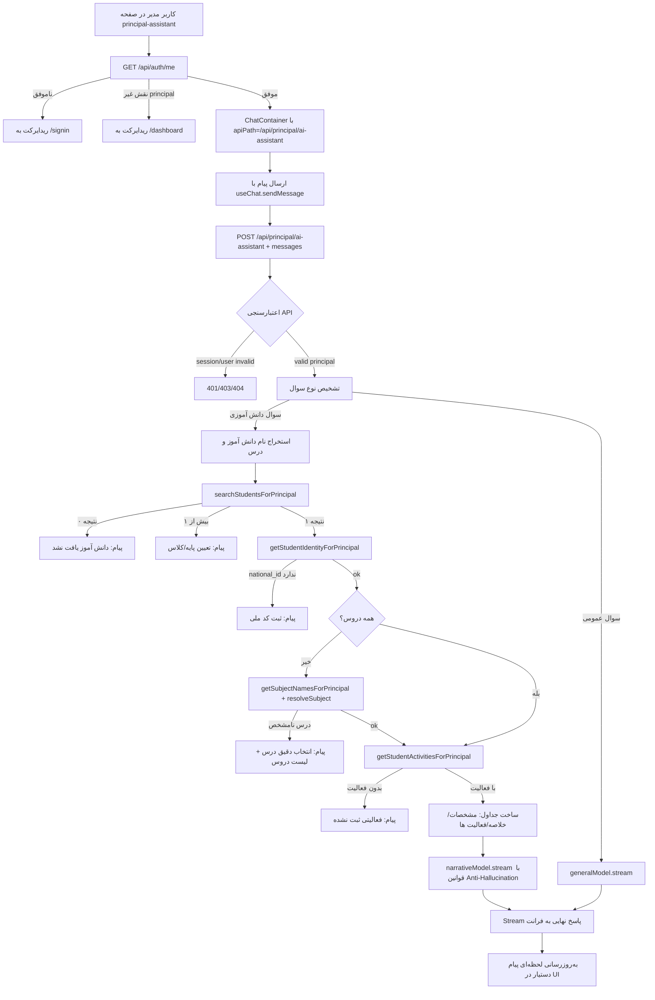
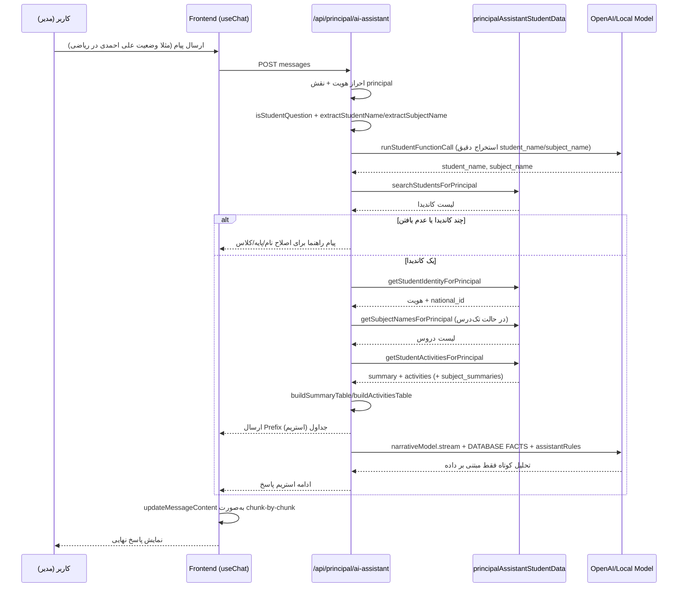

# دیاگرام کامل پاسخ‌دهی دستیار مدیر

این سند بر اساس مرور کدها و مستندات زیر تهیه شده است:
- `CLAUDE.md`
- `docs/PRINCIPAL_ASSISTANT_IMPROVEMENTS.md`
- `src/app/dashboard/principal/principal-assistant/page.tsx`
- `src/app/components/AIChat/ChatContainer.tsx`
- `src/app/components/AIChat/hooks/useChat.ts`
- `src/app/api/principal/ai-assistant/route.ts`
- `src/lib/principalAssistantStudentData.ts`
- `src/lib/messengerPrincipalAssistant.ts`

## 1) دیاگرام کلان جریان پاسخ‌دهی

## 2) دیاگرام توالی دقیق برای سوال دانش‌آموزی

## 3) منطق تصمیم‌گیری پاسخ

1. ورودی کاربر در UI به `POST /api/principal/ai-assistant` ارسال می‌شود.
2. API ابتدا فقط دسترسی `principal` را می‌پذیرد.
3. اگر سوال دانش‌آموزی تشخیص داده شود:
   - نام دانش‌آموز و نام درس با ترکیب Regex و Function Call استخراج می‌شود.
   - دانش‌آموز در همان `school_id` جستجو می‌شود.
   - ابهام نام با درخواست پایه/کلاس رفع می‌شود.
   - داده‌ها فقط از دیتابیس و به‌صورت `READ ONLY` خوانده می‌شود.
   - پاسخ در دو بخش است:
     - بخش اول: جدول‌های واقعی (مشخصات، خلاصه، فعالیت‌ها)
     - بخش دوم: تحلیل کوتاه مدل زبانی با قوانین ضدتوهم
4. اگر سوال دانش‌آموزی نباشد، پاسخ مستقیم از مدل عمومی (`generalModel.stream`) برمی‌گردد.

## 4) الگوی ضدتوهم در پاسخ

- قواعد `assistantRules` داخل API صراحتا جعل عدد/تاریخ/فعالیت را ممنوع می‌کند.
- در Prompt عبارت‌های `DATABASE FACTS` و `EXACT DATA - DO NOT MODIFY` استفاده شده است.
- مدل روایی (`narrativeModel`) فقط مجاز به تحلیل کوتاه بر اساس داده موجود است.
- اگر داده‌ای وجود نداشته باشد، API پیام صریح «فعالیتی ثبت نشده است» می‌دهد و مدل اجازه پرکردن خلأ با حدس را ندارد.

## 5) خروجی‌های کنترلی مهم

- کاربر غیرمجاز: `401/403`
- دانش‌آموز یافت نشد: پیام اصلاح املای نام
- چند دانش‌آموز همنام: درخواست تعیین پایه/کلاس
- درس نامشخص: نمایش لیست دروس مدرسه
- نبود فعالیت: پیام «فعالیتی ثبت نشده است»
- Timeout مدل: متن fallback برای توقف/عدم تولید توضیح تکمیلی

## 6) نکات فنی تایید شده از مرور کد

- مسیر فرانت درست: `/dashboard/principal/principal-assistant`
- مسیر API اصلی: `/api/principal/ai-assistant`
- خواندن داده دانش‌آموزی در `src/lib/principalAssistantStudentData.ts` با:
  - `BEGIN READ ONLY`
  - `statement_timeout`
  - فیلتر `school_id`
- استریم پاسخ در فرانت با `ReadableStream` و به‌روزرسانی لحظه‌ای پیام دستیار انجام می‌شود.

## 7) قابلیت جدید: تحلیل عملکرد کلاس

در منطق API یک مسیر جدید برای سوالات کلاس اضافه شد:
- تشخیص سوال کلاس با `isClassQuestion`
- استخراج نام کلاس با `extractClassName` + `runClassFunctionCall`
- جستجوی کلاس با `searchClassesForPrincipal`
- استخراج KPIهای آموزشی کلاس با `getClassPerformanceForPrincipal`

شاخص‌های کلیدی خروجی کلاس:
- تعداد دانش‌آموز و معلم کلاس
- تعداد فعالیت‌های آموزشی ثبت‌شده
- میانگین نمره فعالیت‌ها
- میانگین درصد نمرات ثبت‌شده (`class_grades`)
- تعداد آزمون‌ها + تعداد آزمون فعال/منتشرشده
- تاریخ آخرین فعالیت
- خلاصه عملکرد درس‌ها و فعالیت‌های اخیر کلاس

الگوی پاسخ:
1. جدول مشخصات کلاس
2. جدول KPIهای کلاس
3. جدول عملکرد درس‌ها (در صورت وجود)
4. جدول فعالیت‌های اخیر (در صورت وجود)
5. جمع‌بندی تحلیلی کوتاه و داده‌محور (بدون توهم)
