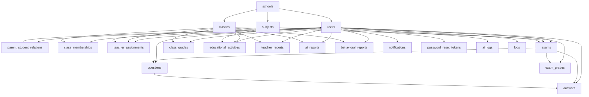

# EduHelper Database Structure Documentation

This document provides a comprehensive overview of the EduHelper database structure, including all tables, relationships, and key implementation details.

## Table of Contents

1. [Overview](#overview)
2. [Core Tables](#core-tables)
3. [User Management](#user-management)
4. [Academic Structure](#academic-structure)
5. [Assessment System](#assessment-system)
6. [Grading System](#grading-system)
7. [Reports and Analytics](#reports-and-analytics)
8. [Communication](#communication)
9. [Authentication and Security](#authentication-and-security)
10. [System Management](#system-management)
11. [Relationships Diagram](#relationships-diagram)
12. [Enums and Types](#enums-and-types)

## Overview

The EduHelper database is built on PostgreSQL and follows a normalized structure to support a comprehensive educational management system. The schema includes entities for schools, users (students, teachers, parents, principals, admins), classes, subjects, assessments, grades, and various reporting features.

## Core Tables

### schools

Stores information about educational institutions.

```sql
CREATE TABLE schools (
  id UUID PRIMARY KEY DEFAULT uuid_generate_v4(),
  name VARCHAR(255) NOT NULL,
  address TEXT,
  postal_code VARCHAR(10),
  phone VARCHAR(20),
  email VARCHAR(255),
  established_year INTEGER,
  grade_level VARCHAR(50),
  region VARCHAR(10),
  gender_type VARCHAR(10),
  latitude DECIMAL(10, 8),
  longitude DECIMAL(11, 8),
  created_at TIMESTAMPTZ DEFAULT NOW(),
  updated_at TIMESTAMPTZ DEFAULT NOW()
);
```

Key Features:

- Geographic information (latitude/longitude)
- Contact details
- Institutional metadata

## User Management

### users

Central table for all user types in the system.

```sql
CREATE TABLE users (
  id UUID PRIMARY KEY DEFAULT uuid_generate_v4(),
  school_id UUID REFERENCES schools(id) ON DELETE CASCADE,
  email VARCHAR(255) UNIQUE,
  password_hash VARCHAR(255),
  phone VARCHAR(20) UNIQUE,
  name VARCHAR(255),
  national_id VARCHAR(10) UNIQUE,
  role user_role NOT NULL DEFAULT 'teacher',
  profile JSONB DEFAULT '{}'::jsonb,
  is_active BOOLEAN DEFAULT true,
  last_login TIMESTAMPTZ,
  created_at TIMESTAMPTZ DEFAULT NOW(),
  updated_at TIMESTAMPTZ DEFAULT NOW()
);
```

Supported Roles:

- `school_admin`: System administrators
- `principal`: School principals
- `teacher`: Educators
- `student`: Students
- `parent`: Parents/Guardians

Key Features:

- Role-based access control
- Multiple authentication methods (email/password, phone OTP, national ID)
- Profile JSON field for flexible user data
- School association for all users

### parent_student_relations

Manages relationships between parents and students.

```sql
CREATE TABLE parent_student_relations (
  id UUID PRIMARY KEY DEFAULT uuid_generate_v4(),
  parent_id UUID REFERENCES users(id) ON DELETE CASCADE,
  student_id UUID REFERENCES users(id) ON DELETE CASCADE,
  relationship VARCHAR(50),
  created_at TIMESTAMPTZ DEFAULT NOW(),
  UNIQUE(parent_id, student_id)
);
```

## Academic Structure

### classes

Represents educational classes/groups.

```sql
CREATE TABLE classes (
  id UUID PRIMARY KEY DEFAULT uuid_generate_v4(),
  school_id UUID REFERENCES schools(id) ON DELETE CASCADE,
  name VARCHAR(255) NOT NULL,
  grade_level VARCHAR(10),
  section VARCHAR(10),
  academic_year VARCHAR(20),
  description TEXT,
  subject VARCHAR(100),
  created_at TIMESTAMPTZ DEFAULT NOW(),
  updated_at TIMESTAMPTZ DEFAULT NOW()
);
```

### lessons

Academic lessons/subjects offered in schools. This is the main table for curriculum management.

```sql
CREATE TABLE lessons (
  id UUID PRIMARY KEY DEFAULT gen_random_uuid(),
  school_id UUID NOT NULL REFERENCES schools(id) ON DELETE CASCADE,
  title VARCHAR(255) NOT NULL,
  description TEXT,
  grade_level VARCHAR(50) NOT NULL,
  created_by UUID NOT NULL REFERENCES users(id),
  created_at TIMESTAMP DEFAULT CURRENT_TIMESTAMP,
  updated_at TIMESTAMP DEFAULT CURRENT_TIMESTAMP,
  UNIQUE(school_id, title, grade_level)
);
```

**Grade Level Values**:
- Elementary: `اول`, `دوم`, `سوم`, `چهارم`, `پنجم`, `ششم`
- Middle School: `هفتم`, `هشتم`, `نهم`
- High School: `دهم-مشترک`, `یازدهم-مشترک`, `دوازدهم-مشترک`, `دهم-ریاضی`, `دهم-تجربی`, `دهم-انسانی`, etc.
- All Grades: `همه` (for subjects available to all grade levels)

**Key Features**:
- Contains Iran national curriculum (162 lessons)
- Schools can add custom lessons
- Unique constraint prevents duplicates per school
- Supports filtering by grade level

### subjects (Legacy - Deprecated)

⚠️ **Note**: This table is deprecated and kept for backward compatibility only. All new development should use the `lessons` table.

```sql
CREATE TABLE subjects (
  id UUID PRIMARY KEY DEFAULT uuid_generate_v4(),
  school_id UUID REFERENCES schools(id) ON DELETE CASCADE,
  name VARCHAR(255) NOT NULL,
  code VARCHAR(50),
  description TEXT,
  grade_level VARCHAR(10),
  created_at TIMESTAMPTZ DEFAULT NOW()
);
```

**Migration Status**: All foreign keys have been updated to reference `lessons` instead of `subjects`. See [SUBJECTS_TO_LESSONS_MIGRATION.md](./SUBJECTS_TO_LESSONS_MIGRATION.md) for details.

### class_memberships

Many-to-many relationship between users and classes.

```sql
CREATE TABLE class_memberships (
  id UUID PRIMARY KEY DEFAULT uuid_generate_v4(),
  class_id UUID REFERENCES classes(id) ON DELETE CASCADE,
  user_id UUID REFERENCES users(id) ON DELETE CASCADE,
  role VARCHAR(20) NOT NULL,
  joined_at TIMESTAMPTZ DEFAULT NOW(),
  UNIQUE(class_id, user_id)
);
```

Membership Roles:

- `teacher`: Educator assigned to the class
- `student`: Student enrolled in the class

### teacher_assignments

Tracks which teachers are assigned to teach which lessons in classes.

```sql
CREATE TABLE teacher_assignments (
  id UUID PRIMARY KEY DEFAULT uuid_generate_v4(),
  class_id UUID REFERENCES classes(id) ON DELETE CASCADE,
  teacher_id UUID REFERENCES users(id) ON DELETE CASCADE,
  subject_id UUID REFERENCES lessons(id) ON DELETE SET NULL,
  subject TEXT,
  assigned_at TIMESTAMPTZ NOT NULL DEFAULT NOW(),
  removed_at TIMESTAMPTZ
);
```

**Note**: The field is named `subject_id` for historical reasons, but it now references the `lessons` table (not `subjects`).

## Assessment System

### exams

Represents assessments and tests.

```sql
CREATE TABLE exams (
  id UUID PRIMARY KEY DEFAULT uuid_generate_v4(),
  school_id UUID REFERENCES schools(id) ON DELETE CASCADE,
  class_id UUID REFERENCES classes(id) ON DELETE CASCADE,
  subject_id UUID REFERENCES subjects(id) ON DELETE SET NULL,
  teacher_id UUID REFERENCES users(id) ON DELETE CASCADE,
  title VARCHAR(255) NOT NULL,
  description TEXT,
  instructions TEXT,
  duration_minutes INTEGER,
  total_points NUMERIC DEFAULT 0,
  starts_at TIMESTAMPTZ,
  ends_at TIMESTAMPTZ,
  status exam_status DEFAULT 'draft',
  settings JSONB DEFAULT '{}'::jsonb,
  created_at TIMESTAMPTZ DEFAULT NOW(),
  updated_at TIMESTAMPTZ DEFAULT NOW()
);
```

Exam Status Options:

- `draft`: Being prepared
- `published`: Available to students
- `active`: Currently in progress
- `ended`: Completed
- `archived`: Stored for reference

### questions

Individual questions within exams.

```sql
CREATE TABLE questions (
  id UUID PRIMARY KEY DEFAULT uuid_generate_v4(),
  exam_id UUID REFERENCES exams(id) ON DELETE CASCADE,
  author_id UUID REFERENCES users(id) ON DELETE SET NULL,
  question_order INTEGER NOT NULL,
  type question_type NOT NULL,
  content TEXT NOT NULL,
  choices JSONB,
  correct_answer JSONB,
  points NUMERIC DEFAULT 1,
  explanation TEXT,
  difficulty_level INTEGER DEFAULT 1,
  tags TEXT[],
  created_at TIMESTAMPTZ DEFAULT NOW()
);
```

Question Types:

- `mcq`: Multiple choice questions
- `descriptive`: Descriptive/essay questions
- `true_false`: True/false questions
- `short_answer`: Short answer questions

### answers

Student responses to questions.

```sql
CREATE TABLE answers (
  id UUID PRIMARY KEY DEFAULT uuid_generate_v4(),
  exam_id UUID REFERENCES exams(id) ON DELETE CASCADE,
  question_id UUID REFERENCES questions(id) ON DELETE CASCADE,
  student_id UUID REFERENCES users(id) ON DELETE CASCADE,
  submitted_at TIMESTAMPTZ NOT NULL DEFAULT NOW(),
  answer JSONB NOT NULL,
  ai_score NUMERIC,
  ai_confidence NUMERIC,
  ai_feedback JSONB,
  teacher_score NUMERIC,
  final_score NUMERIC,
  graded_by UUID REFERENCES users(id) ON DELETE SET NULL,
  graded_at TIMESTAMPTZ,
  status answer_status NOT NULL DEFAULT 'submitted',
  remarks TEXT,
  metadata JSONB DEFAULT '{}'::jsonb,
  UNIQUE(exam_id, question_id, student_id)
);
```

Answer Status Options:

- `submitted`: Student has submitted
- `ai_graded`: Graded by AI
- `teacher_reviewed`: Reviewed by teacher
- `finalized`: Final grade recorded

## Grading System

### exam_grades

Final grades for each student on each exam.

```sql
CREATE TABLE exam_grades (
  id UUID PRIMARY KEY DEFAULT uuid_generate_v4(),
  exam_id UUID REFERENCES exams(id) ON DELETE CASCADE,
  student_id UUID REFERENCES users(id) ON DELETE CASCADE,
  total_score NUMERIC,
  max_score NUMERIC,
  percentage NUMERIC,
  grade_letter VARCHAR(5),
  is_released BOOLEAN DEFAULT FALSE,
  computed_at TIMESTAMPTZ,
  created_at TIMESTAMPTZ DEFAULT NOW(),
  UNIQUE (exam_id, student_id)
);
```

### class_grades

General class grades for regular subject grading.

```sql
CREATE TABLE class_grades (
  id UUID PRIMARY KEY DEFAULT uuid_generate_v4(),
  class_id UUID REFERENCES classes(id) ON DELETE CASCADE,
  student_id UUID REFERENCES users(id) ON DELETE CASCADE,
  teacher_id UUID REFERENCES users(id) ON DELETE CASCADE,
  subject_name VARCHAR(255) NOT NULL,
  grade_value NUMERIC NOT NULL,
  max_score NUMERIC DEFAULT 100,
  percentage NUMERIC,
  grade_letter VARCHAR(5),
  term VARCHAR(50),
  description TEXT,
  created_at TIMESTAMPTZ DEFAULT NOW(),
  updated_at TIMESTAMPTZ DEFAULT NOW(),
  UNIQUE (class_id, student_id, subject_name, term)
);
```

### educational_activities

Records various educational activities with both quantitative and qualitative evaluations.

```sql
CREATE TABLE educational_activities (
  id UUID PRIMARY KEY DEFAULT uuid_generate_v4(),
  class_id UUID REFERENCES classes(id) ON DELETE CASCADE,
  subject_id UUID REFERENCES lessons(id) ON DELETE CASCADE,
  student_id UUID REFERENCES users(id) ON DELETE CASCADE,
  teacher_id UUID REFERENCES users(id) ON DELETE CASCADE,
  activity_type VARCHAR(50) NOT NULL,
  activity_title VARCHAR(255) NOT NULL,
  activity_date DATE NOT NULL,
  quantitative_score NUMERIC,
  qualitative_evaluation TEXT,
  created_at TIMESTAMPTZ DEFAULT NOW(),
  updated_at TIMESTAMPTZ DEFAULT NOW()
);
```

**Note**: The field is named `subject_id` for historical reasons, but it now references the `lessons` table (not `subjects`). This was updated as part of the subjects-to-lessons migration.

Activity Types:

- `midterm_exam`: Midterm examinations
- `monthly_exam`: Monthly tests
- `weekly_exam`: Weekly assessments
- `class_activity`: In-class activities
- `class_homework`: Class assignments
- `home_homework`: Home assignments

Evaluation Requirements:

- Midterm/Weekly/Monthly Exams: Quantitative score required
- Class Activities/Homework: Both quantitative and qualitative evaluation required
- Home Homework: Quantitative score required

## Reports and Analytics

### teacher_reports

Written reports by teachers about students.

```sql
CREATE TABLE teacher_reports (
  id UUID PRIMARY KEY DEFAULT uuid_generate_v4(),
  teacher_id UUID REFERENCES users(id) ON DELETE CASCADE,
  student_id UUID REFERENCES users(id) ON DELETE CASCADE,
  class_id UUID REFERENCES classes(id) ON DELETE CASCADE,
  content TEXT NOT NULL,
  created_at TIMESTAMPTZ DEFAULT NOW(),
  updated_at TIMESTAMPTZ DEFAULT NOW()
);
```

### ai_reports

AI-generated analytical reports about student performance.

```sql
CREATE TABLE ai_reports (
  id UUID PRIMARY KEY DEFAULT uuid_generate_v4(),
  student_id UUID REFERENCES users(id) ON DELETE CASCADE,
  class_id UUID REFERENCES classes(id) ON DELETE CASCADE,
  content TEXT NOT NULL,
  analysis_points JSONB DEFAULT '{}'::jsonb,
  created_at TIMESTAMPTZ DEFAULT NOW()
);
```

Analysis Points Structure:

- `strengths`: Array of student strengths
- `weaknesses`: Array of areas for improvement
- `recommendations`: Array of suggested actions
- `progress`: Progress description

### behavioral_reports

Reports on student behavior and conduct.

```sql
CREATE TABLE behavioral_reports (
  id UUID PRIMARY KEY DEFAULT uuid_generate_v4(),
  teacher_id UUID REFERENCES users(id) ON DELETE CASCADE,
  student_id UUID REFERENCES users(id) ON DELETE CASCADE,
  class_id UUID REFERENCES classes(id) ON DELETE CASCADE,
  content TEXT NOT NULL,
  category VARCHAR(50) NOT NULL,
  created_at TIMESTAMPTZ DEFAULT NOW(),
  updated_at TIMESTAMPTZ DEFAULT NOW()
);
```

## Communication

### notifications

System notifications for users.

```sql
CREATE TABLE notifications (
  id UUID PRIMARY KEY DEFAULT uuid_generate_v4(),
  user_id UUID REFERENCES users(id) ON DELETE CASCADE,
  title VARCHAR(255) NOT NULL,
  message TEXT,
  type VARCHAR(50),
  data JSONB DEFAULT '{}'::jsonb,
  is_read BOOLEAN DEFAULT FALSE,
  created_at TIMESTAMPTZ DEFAULT NOW()
);
```

Notification Types:

- `exam_published`: New exam available
- `grade_released`: Grades have been published
- `assignment_due`: Assignment deadline approaching
- Custom types as needed

## Authentication and Security

### password_reset_tokens

Tokens for password reset functionality.

```sql
CREATE TABLE password_reset_tokens (
  id UUID PRIMARY KEY DEFAULT uuid_generate_v4(),
  user_id UUID NOT NULL REFERENCES users(id) ON DELETE CASCADE,
  token VARCHAR(255) UNIQUE NOT NULL,
  expires_at TIMESTAMPTZ NOT NULL,
  used BOOLEAN DEFAULT FALSE,
  created_at TIMESTAMPTZ DEFAULT NOW()
);
```

### otp_tokens

Tokens for phone-based one-time password authentication.

```sql
CREATE TABLE otp_tokens (
  id UUID PRIMARY KEY DEFAULT uuid_generate_v4(),
  phone VARCHAR(20) NOT NULL,
  otp_code VARCHAR(6) NOT NULL,
  expires_at TIMESTAMPTZ NOT NULL,
  verified BOOLEAN DEFAULT FALSE,
  attempts INTEGER DEFAULT 0,
  created_at TIMESTAMPTZ DEFAULT NOW()
);
```

### ai_logs

Logs of AI processing activities.

```sql
CREATE TABLE ai_logs (
  id UUID PRIMARY KEY DEFAULT uuid_generate_v4(),
  answer_id UUID REFERENCES answers(id) ON DELETE CASCADE,
  request_payload JSONB,
  response_payload JSONB,
  processing_time_ms INTEGER,
  success BOOLEAN,
  error_message TEXT,
  ai_model_version VARCHAR(50),
  created_at TIMESTAMPTZ DEFAULT NOW()
);
```

### logs

General system logging for monitoring and debugging.

```sql
CREATE TABLE logs (
  id UUID PRIMARY KEY DEFAULT uuid_generate_v4(),
  timestamp TIMESTAMPTZ DEFAULT NOW(),
  level VARCHAR(20) NOT NULL,
  message TEXT NOT NULL,
  meta JSONB,
  user_id UUID REFERENCES users(id) ON DELETE SET NULL,
  ip_address VARCHAR(45),
  user_agent TEXT,
  url TEXT,
  method VARCHAR(10),
  status_code INTEGER,
  response_time INTEGER,
  created_at TIMESTAMPTZ DEFAULT NOW()
);
```

## System Management

### Database Extensions

The system requires the following PostgreSQL extensions:

- `uuid-ossp`: For UUID generation
- `pgcrypto`: For password hashing and cryptographic functions

### Triggers

Several triggers are implemented to maintain data integrity:

- `update_updated_at_column`: Automatically updates the `updated_at` timestamp on record modification
- `update_educational_activities_updated_at_column`: Specific trigger for educational activities

## Relationships Diagram



## Enums and Types

### user_role

Defines the different types of users in the system:

- `school_admin`
- `principal`
- `teacher`
- `student`
- `parent`

### exam_status

Represents the current state of an exam:

- `draft`
- `published`
- `active`
- `ended`
- `archived`

### question_type

Categorizes different types of questions:

- `mcq`
- `descriptive`
- `true_false`
- `short_answer`

### answer_status

Tracks the grading state of student answers:

- `submitted`
- `ai_graded`
- `teacher_reviewed`
- `finalized`

This comprehensive database structure supports all core educational functions including user management, academic organization, assessment creation and grading, reporting, and communication features. The design emphasizes data integrity through proper foreign key relationships and provides flexibility through JSON fields for extensible data storage.
