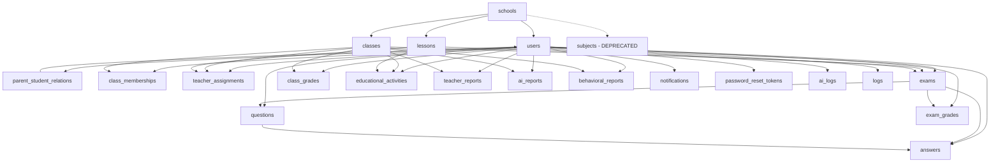
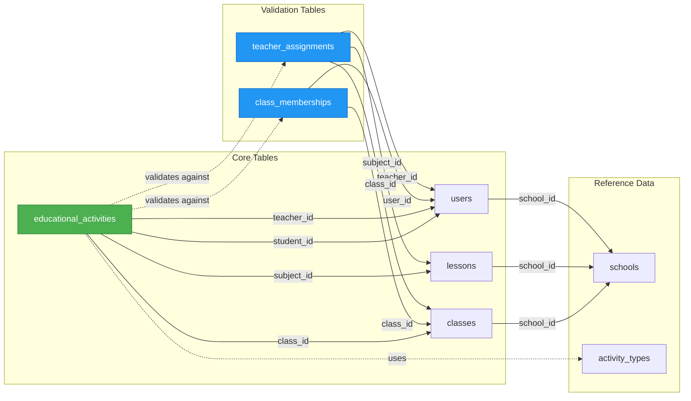
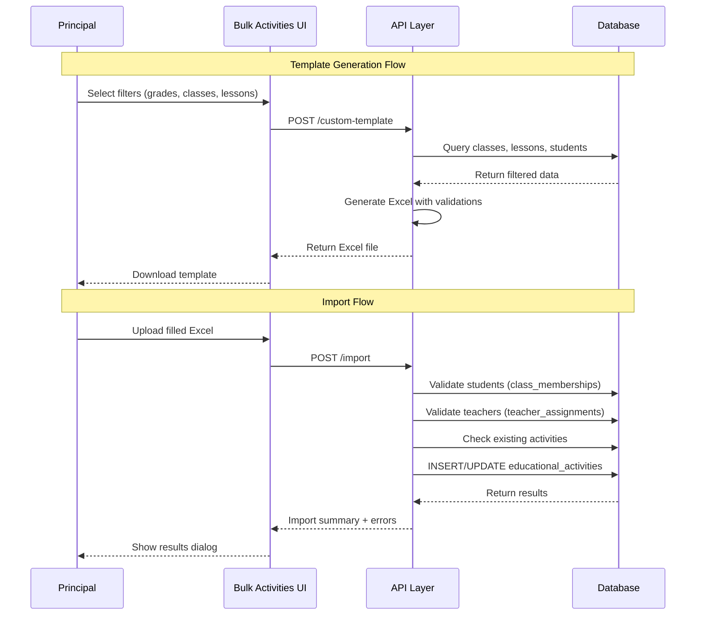

# kama Database Structure Documentation

This document provides a comprehensive overview of the kama database structure, including all tables, relationships, and key implementation details.

## Table of Contents

1. [Overview](#overview)
2. [Core Tables](#core-tables)
3. [User Management](#user-management)
4. [Academic Structure](#academic-structure)
5. [Assessment System](#assessment-system)
6. [Grading System](#grading-system)
7. [Bulk Activities Management](#bulk-activities-management)
8. [Reports and Analytics](#reports-and-analytics)
9. [Communication](#communication)
10. [Authentication and Security](#authentication-and-security)
11. [System Management](#system-management)
12. [Relationships Diagram](#relationships-diagram)
13. [Enums and Types](#enums-and-types)

## Overview

The kama database is built on PostgreSQL and follows a normalized structure to support a comprehensive educational management system. The schema includes entities for schools, users (students, teachers, parents, principals, admins), classes, subjects, assessments, grades, and various reporting features.

## Core Tables

### schools

Stores information about educational institutions.

```sql
CREATE TABLE schools (
  id UUID PRIMARY KEY DEFAULT uuid_generate_v4(),
  name VARCHAR(255) NOT NULL,
  address TEXT,
  postal_code VARCHAR(10),
  phone VARCHAR(20),
  email VARCHAR(255),
  established_year INTEGER,
  grade_level VARCHAR(50),
  region VARCHAR(10),
  gender_type VARCHAR(10),
  latitude DECIMAL(10, 8),
  longitude DECIMAL(11, 8),
  created_at TIMESTAMPTZ DEFAULT NOW(),
  updated_at TIMESTAMPTZ DEFAULT NOW()
);
```

Key Features:

- Geographic information (latitude/longitude)
- Contact details
- Institutional metadata

## User Management

### users

Central table for all user types in the system. This table stores information for students, teachers, principals, parents, and administrators.

```sql
CREATE TABLE users (
  id UUID PRIMARY KEY DEFAULT uuid_generate_v4(),
  school_id UUID REFERENCES schools(id) ON DELETE CASCADE,
  email VARCHAR(255) UNIQUE,
  password_hash VARCHAR(255),
  phone VARCHAR(20) UNIQUE,
  name VARCHAR(255),
  national_id VARCHAR(10) UNIQUE,
  role user_role NOT NULL DEFAULT 'teacher',
  profile JSONB DEFAULT '{}'::jsonb,
  is_active BOOLEAN DEFAULT true,
  last_login TIMESTAMPTZ,
  created_at TIMESTAMPTZ DEFAULT NOW(),
  updated_at TIMESTAMPTZ DEFAULT NOW()
);
```

**Supported Roles**:

| Role | Persian Name | Description |
|------|--------------|-------------|
| `school_admin` | مدیر سیستم | System administrators with full access |
| `principal` | مدیر مدرسه | School principals with school-wide access |
| `teacher` | معلم | Educators who teach classes and grade activities |
| `student` | دانش‌آموز | Students enrolled in classes |
| `parent` | ولی | Parents/Guardians of students |

**Key Features**:

- **Role-Based Access Control**: Different permissions based on user role
- **Multiple Authentication Methods**:
  - Email/Password authentication
  - Phone OTP (One-Time Password)
  - National ID verification
- **Profile JSON Field**: Flexible storage for additional user data
- **School Association**: All users belong to a specific school
- **Activity Tracking**: Records last login timestamp

**Student-Related Fields** (used in educational_activities):

- **name**: Full name of the student (displayed in activity reports)
- **school_id**: Links student to their school
- **role = 'student'**: Identifies user as a student
- **is_active**: Indicates if student is currently enrolled

**Teacher-Related Fields** (used in educational_activities):

- **name**: Full name of the teacher
- **role = 'teacher'**: Identifies user as a teacher
- **Teacher assignments link teachers to classes and subjects**

**Usage in Bulk Activities**:

1. **Student Selection**:
   - Students are filtered by class membership
   - Student names appear in activity records
   - Used for validation during Excel import

2. **Teacher Assignment**:
   - Teachers must be assigned to the subject and class
   - Teacher names are recorded with each activity
   - Validated during bulk import operations

3. **Principal Access**:
   - Principals can manage all activities in their school
   - Access controlled via school_id matching

**Common Queries**:

```sql
-- Get all students in a class
SELECT u.*
FROM users u
JOIN class_memberships cm ON u.id = cm.user_id
WHERE cm.class_id = $1 AND cm.role = 'student';

-- Get all teachers in a school
SELECT * FROM users
WHERE school_id = $1 AND role = 'teacher';
```

### parent_student_relations

Manages relationships between parents and students.

```sql
CREATE TABLE parent_student_relations (
  id UUID PRIMARY KEY DEFAULT uuid_generate_v4(),
  parent_id UUID REFERENCES users(id) ON DELETE CASCADE,
  student_id UUID REFERENCES users(id) ON DELETE CASCADE,
  relationship VARCHAR(50),
  created_at TIMESTAMPTZ DEFAULT NOW(),
  UNIQUE(parent_id, student_id)
);
```

## Academic Structure

### classes

Represents educational classes/groups within a school. Classes are organized by grade level and can have multiple sections.

```sql
CREATE TABLE classes (
  id UUID PRIMARY KEY DEFAULT uuid_generate_v4(),
  school_id UUID REFERENCES schools(id) ON DELETE CASCADE,
  name VARCHAR(255) NOT NULL,
  grade_level VARCHAR(10),
  section VARCHAR(10),
  academic_year VARCHAR(20),
  description TEXT,
  subject VARCHAR(100),
  created_at TIMESTAMPTZ DEFAULT NOW(),
  updated_at TIMESTAMPTZ DEFAULT NOW()
);
```

**Grade Level Values** (Iranian Education System):

| Level | Grade Values |
|-------|--------------|
| **Elementary** (ابتدایی) | `اول`, `دوم`, `سوم`, `چهارم`, `پنجم`, `ششم` |
| **Middle School** (متوسطه اول) | `هفتم`, `هشتم`, `نهم` |
| **High School** (متوسطه دوم) | `دهم-مشترک`, `یازدهم-مشترک`, `دوازدهم-مشترک` |
| **Math Track** (ریاضی) | `دهم-ریاضی`, `یازدهم-ریاضی`, `دوازدهم-ریاضی` |
| **Science Track** (تجربی) | `دهم-تجربی`, `یازدهم-تجربی`, `دوازدهم-تجربی` |
| **Humanities Track** (انسانی) | `دهم-انسانی`, `یازدهم-انسانی`, `دوازدهم-انسانی` |

**Key Features**:

- **Name**: Class identifier (e.g., "الف", "ب", "ج")
- **Section**: Optional subsection for larger classes (e.g., "1", "2")
- **Display Format**: Classes are typically displayed as "Grade-Name-Section" (e.g., "هفتم-الف-1")
- **School Association**: All classes belong to a specific school
- **Academic Year**: Tracks the year the class is active

**Usage in Bulk Activities**:

Classes are used to filter and organize activities in the bulk management system. When generating custom templates, users can:
- Filter classes by grade level
- Select specific classes with their sections
- View all students enrolled in selected classes

### lessons

Academic lessons/subjects offered in schools. This is the main table for curriculum management and replaces the deprecated `subjects` table.

```sql
CREATE TABLE lessons (
  id UUID PRIMARY KEY DEFAULT gen_random_uuid(),
  school_id UUID NOT NULL REFERENCES schools(id) ON DELETE CASCADE,
  title VARCHAR(255) NOT NULL,
  description TEXT,
  grade_level VARCHAR(50) NOT NULL,
  created_by UUID NOT NULL REFERENCES users(id),
  created_at TIMESTAMP DEFAULT CURRENT_TIMESTAMP,
  updated_at TIMESTAMP DEFAULT CURRENT_TIMESTAMP,
  UNIQUE(school_id, title, grade_level)
);
```

**Grade Level Values**:

| Category | Values |
|----------|--------|
| **Elementary** | `اول`, `دوم`, `سوم`, `چهارم`, `پنجم`, `ششم` |
| **Middle School** | `هفتم`, `هشتم`, `نهم` |
| **High School Shared** | `دهم-مشترک`, `یازدهم-مشترک`, `دوازدهم-مشترک` |
| **Math Track** | `دهم-ریاضی`, `یازدهم-ریاضی`, `دوازدهم-ریاضی` |
| **Science Track** | `دهم-تجربی`, `یازدهم-تجربی`, `دوازدهم-تجربی` |
| **Humanities Track** | `دهم-انسانی`, `یازدهم-انسانی`, `دوازدهم-انسانی` |
| **All Grades** | `همه` (for subjects available to all grade levels) |

**Key Features**:

- **National Curriculum**: Contains 162 lessons from Iran's national curriculum
- **Custom Lessons**: Schools can add their own custom lessons
- **Grade-Level Filtering**: Lessons are filtered based on selected grade levels
- **Unique Constraint**: Prevents duplicate lessons per school and grade level
- **Flexible Assignment**: Lessons with `همه` grade level appear for all grades

**Usage in Bulk Activities**:

When generating custom activity templates:
1. Lessons are filtered by selected grade levels
2. Lessons with grade_level = `همه` always appear in the list
3. Multiple lessons with the same name are grouped together
4. Users can select lessons to include in their activity template

**Common Lesson Examples**:

- **Elementary**: ریاضی, فارسی, علوم, مطالعات اجتماعی, قرآن
- **Middle School**: ریاضی, علوم تجربی, فارسی, عربی, انگلیسی, مطالعات اجتماعی
- **High School Math**: حسابان, هندسه, آمار و احتمال, گسسته
- **High School Science**: فیزیک, شیمی, زیست‌شناسی, علوم زمین
- **High School Humanities**: تاریخ, جغرافیا, جامعه‌شناسی, اقتصاد

**Related APIs**:

- `GET /api/principal/subjects` - Fetch lessons organized by grade level
- Lessons are used in teacher assignments and educational activities

### subjects (Legacy - Deprecated)

⚠️ **Note**: This table is deprecated and kept for backward compatibility only. All new development should use the `lessons` table.

```sql
CREATE TABLE subjects (
  id UUID PRIMARY KEY DEFAULT uuid_generate_v4(),
  school_id UUID REFERENCES schools(id) ON DELETE CASCADE,
  name VARCHAR(255) NOT NULL,
  code VARCHAR(50),
  description TEXT,
  grade_level VARCHAR(10),
  created_at TIMESTAMPTZ DEFAULT NOW()
);
```

**Migration Status**: All foreign keys have been updated to reference `lessons` instead of `subjects`. See [SUBJECTS_TO_LESSONS_MIGRATION.md](./SUBJECTS_TO_LESSONS_MIGRATION.md) for details.

### class_memberships

Many-to-many relationship table that manages which users (students and teachers) belong to which classes. This is essential for organizing educational activities and determining class rosters.

```sql
CREATE TABLE class_memberships (
  id UUID PRIMARY KEY DEFAULT uuid_generate_v4(),
  class_id UUID REFERENCES classes(id) ON DELETE CASCADE,
  user_id UUID REFERENCES users(id) ON DELETE CASCADE,
  role VARCHAR(20) NOT NULL,
  joined_at TIMESTAMPTZ DEFAULT NOW(),
  UNIQUE(class_id, user_id)
);
```

**Membership Roles**:

| Role | Description |
|------|-------------|
| `teacher` | Educator assigned to teach the class |
| `student` | Student enrolled in the class |

**Key Features**:

- **Unique Constraint**: Each user can only be added once per class
- **Cascade Delete**: Memberships are removed when class or user is deleted
- **Timestamp Tracking**: Records when user joined the class

**Usage in Bulk Activities**:

1. **Student Validation**:
   - During Excel import, system validates that students are enrolled in the specified class
   - Used to generate student lists for custom templates

2. **Class Roster**:
   - Determines which students should appear in activity templates
   - Used for filtering students by class when creating activities

**Common Queries**:

```sql
-- Get all students in a specific class
SELECT u.id, u.name, u.national_id
FROM users u
JOIN class_memberships cm ON u.id = cm.user_id
WHERE cm.class_id = $1 AND cm.role = 'student'
ORDER BY u.name;

-- Get all classes for a student
SELECT c.*, cm.joined_at
FROM classes c
JOIN class_memberships cm ON c.id = cm.class_id
WHERE cm.user_id = $1 AND cm.role = 'student';
```

### teacher_assignments

Tracks which teachers are assigned to teach which lessons (subjects) in specific classes. This table is crucial for validating teacher permissions when recording educational activities.

```sql
CREATE TABLE teacher_assignments (
  id UUID PRIMARY KEY DEFAULT uuid_generate_v4(),
  class_id UUID REFERENCES classes(id) ON DELETE CASCADE,
  teacher_id UUID REFERENCES users(id) ON DELETE CASCADE,
  subject_id UUID REFERENCES lessons(id) ON DELETE SET NULL,
  subject TEXT,
  assigned_at TIMESTAMPTZ NOT NULL DEFAULT NOW(),
  removed_at TIMESTAMPTZ
);
```

**Note**: The field is named `subject_id` for historical reasons, but it now references the `lessons` table (not `subjects`). This was updated as part of the subjects-to-lessons migration.

**Key Features**:

- **Teacher-Subject-Class Relationship**: Links teachers to specific subjects in specific classes
- **Soft Delete**: Uses `removed_at` timestamp instead of hard deletion for historical tracking
- **Active Assignments**: Records with `removed_at = NULL` are currently active

**Usage in Bulk Activities**:

1. **Teacher Validation**:
   - During Excel import, validates that the teacher is assigned to teach the subject in the specified class
   - Prevents unauthorized activity recording

2. **Template Generation**:
   - Used to populate teacher lists for specific class-subject combinations
   - Ensures only valid teachers appear in dropdown selections

3. **Activity Authorization**:
   - Verifies teacher has permission to record activities for a subject
   - Checked before creating or updating educational activities

**Common Queries**:

```sql
-- Get all active assignments for a teacher
SELECT ta.*, c.name as class_name, l.title as lesson_title
FROM teacher_assignments ta
JOIN classes c ON ta.class_id = c.id
LEFT JOIN lessons l ON ta.subject_id = l.id
WHERE ta.teacher_id = $1 AND ta.removed_at IS NULL;

-- Verify teacher can teach a subject in a class
SELECT EXISTS(
  SELECT 1 FROM teacher_assignments
  WHERE teacher_id = $1
    AND class_id = $2
    AND subject_id = $3
    AND removed_at IS NULL
) as is_authorized;

-- Get all teachers for a subject in a class
SELECT u.id, u.name
FROM users u
JOIN teacher_assignments ta ON u.id = ta.teacher_id
WHERE ta.class_id = $1
  AND ta.subject_id = $2
  AND ta.removed_at IS NULL;
```

## Assessment System

### exams

Represents assessments and tests.

```sql
CREATE TABLE exams (
  id UUID PRIMARY KEY DEFAULT uuid_generate_v4(),
  school_id UUID REFERENCES schools(id) ON DELETE CASCADE,
  class_id UUID REFERENCES classes(id) ON DELETE CASCADE,
  subject_id UUID REFERENCES subjects(id) ON DELETE SET NULL,
  teacher_id UUID REFERENCES users(id) ON DELETE CASCADE,
  title VARCHAR(255) NOT NULL,
  description TEXT,
  instructions TEXT,
  duration_minutes INTEGER,
  total_points NUMERIC DEFAULT 0,
  starts_at TIMESTAMPTZ,
  ends_at TIMESTAMPTZ,
  status exam_status DEFAULT 'draft',
  settings JSONB DEFAULT '{}'::jsonb,
  created_at TIMESTAMPTZ DEFAULT NOW(),
  updated_at TIMESTAMPTZ DEFAULT NOW()
);
```

Exam Status Options:

- `draft`: Being prepared
- `published`: Available to students
- `active`: Currently in progress
- `ended`: Completed
- `archived`: Stored for reference

### questions

Individual questions within exams.

```sql
CREATE TABLE questions (
  id UUID PRIMARY KEY DEFAULT uuid_generate_v4(),
  exam_id UUID REFERENCES exams(id) ON DELETE CASCADE,
  author_id UUID REFERENCES users(id) ON DELETE SET NULL,
  question_order INTEGER NOT NULL,
  type question_type NOT NULL,
  content TEXT NOT NULL,
  choices JSONB,
  correct_answer JSONB,
  points NUMERIC DEFAULT 1,
  explanation TEXT,
  difficulty_level INTEGER DEFAULT 1,
  tags TEXT[],
  created_at TIMESTAMPTZ DEFAULT NOW()
);
```

Question Types:

- `mcq`: Multiple choice questions
- `descriptive`: Descriptive/essay questions
- `true_false`: True/false questions
- `short_answer`: Short answer questions

### answers

Student responses to questions.

```sql
CREATE TABLE answers (
  id UUID PRIMARY KEY DEFAULT uuid_generate_v4(),
  exam_id UUID REFERENCES exams(id) ON DELETE CASCADE,
  question_id UUID REFERENCES questions(id) ON DELETE CASCADE,
  student_id UUID REFERENCES users(id) ON DELETE CASCADE,
  submitted_at TIMESTAMPTZ NOT NULL DEFAULT NOW(),
  answer JSONB NOT NULL,
  ai_score NUMERIC,
  ai_confidence NUMERIC,
  ai_feedback JSONB,
  teacher_score NUMERIC,
  final_score NUMERIC,
  graded_by UUID REFERENCES users(id) ON DELETE SET NULL,
  graded_at TIMESTAMPTZ,
  status answer_status NOT NULL DEFAULT 'submitted',
  remarks TEXT,
  metadata JSONB DEFAULT '{}'::jsonb,
  UNIQUE(exam_id, question_id, student_id)
);
```

Answer Status Options:

- `submitted`: Student has submitted
- `ai_graded`: Graded by AI
- `teacher_reviewed`: Reviewed by teacher
- `finalized`: Final grade recorded

## Grading System

### exam_grades

Final grades for each student on each exam.

```sql
CREATE TABLE exam_grades (
  id UUID PRIMARY KEY DEFAULT uuid_generate_v4(),
  exam_id UUID REFERENCES exams(id) ON DELETE CASCADE,
  student_id UUID REFERENCES users(id) ON DELETE CASCADE,
  total_score NUMERIC,
  max_score NUMERIC,
  percentage NUMERIC,
  grade_letter VARCHAR(5),
  is_released BOOLEAN DEFAULT FALSE,
  computed_at TIMESTAMPTZ,
  created_at TIMESTAMPTZ DEFAULT NOW(),
  UNIQUE (exam_id, student_id)
);
```

### class_grades

General class grades for regular subject grading.

```sql
CREATE TABLE class_grades (
  id UUID PRIMARY KEY DEFAULT uuid_generate_v4(),
  class_id UUID REFERENCES classes(id) ON DELETE CASCADE,
  student_id UUID REFERENCES users(id) ON DELETE CASCADE,
  teacher_id UUID REFERENCES users(id) ON DELETE CASCADE,
  subject_name VARCHAR(255) NOT NULL,
  grade_value NUMERIC NOT NULL,
  max_score NUMERIC DEFAULT 100,
  percentage NUMERIC,
  grade_letter VARCHAR(5),
  term VARCHAR(50),
  description TEXT,
  created_at TIMESTAMPTZ DEFAULT NOW(),
  updated_at TIMESTAMPTZ DEFAULT NOW(),
  UNIQUE (class_id, student_id, subject_name, term)
);
```

### educational_activities

Records various educational activities with both quantitative and qualitative evaluations. This table is central to the bulk activities management system (`/dashboard/principal/bulk-activities`).

```sql
CREATE TABLE educational_activities (
  id UUID PRIMARY KEY DEFAULT uuid_generate_v4(),
  class_id UUID REFERENCES classes(id) ON DELETE CASCADE,
  subject_id UUID REFERENCES lessons(id) ON DELETE CASCADE,
  student_id UUID REFERENCES users(id) ON DELETE CASCADE,
  teacher_id UUID REFERENCES users(id) ON DELETE CASCADE,
  activity_type VARCHAR(50) NOT NULL,
  activity_title VARCHAR(255) NOT NULL,
  activity_date DATE NOT NULL,
  quantitative_score NUMERIC,
  qualitative_evaluation TEXT,
  created_at TIMESTAMPTZ DEFAULT NOW(),
  updated_at TIMESTAMPTZ DEFAULT NOW()
);
```

**Note**: The field is named `subject_id` for historical reasons, but it now references the `lessons` table (not `subjects`). This was updated as part of the subjects-to-lessons migration.

**Activity Types** (stored in Persian in the system):

| Type Key | Persian Name | Description |
|----------|--------------|-------------|
| `midterm_exam` | آزمون میان‌ترم | Midterm examinations |
| `monthly_exam` | آزمون ماهیانه | Monthly tests |
| `weekly_exam` | آزمون هفتگی | Weekly assessments |
| `class_activity` | فعالیت کلاسی | In-class activities |
| `class_homework` | تکلیف کلاسی | Class assignments |
| `home_homework` | تکلیف منزل | Home assignments |

**Evaluation Requirements**:

- **Midterm/Weekly/Monthly Exams**: Quantitative score required (0-20 scale)
- **Class Activities/Homework**: Both quantitative and qualitative evaluation required
- **Home Homework**: Quantitative score required

**Bulk Management Features**:

The system provides comprehensive bulk management capabilities through Excel import/export:

1. **Export to Excel**: Export all activities with complete student, class, teacher, and subject information
2. **Import from Excel**: Bulk import activities with validation and error reporting
3. **Custom Template Generation**: Create customized Excel templates with:
   - Selected grade levels (elementary, middle school, high school)
   - Specific classes with sections
   - Filtered lessons based on grade level
   - Selected activity types
   - Default scores and dates pre-filled
4. **Data Validation**: Automatic validation of:
   - Student existence and class membership
   - Teacher assignment to subject and class
   - Activity type requirements
   - Score ranges (0-20)
   - Date formats

**Query Pattern for Bulk Activities Display**:

```sql
SELECT
  ea.id,
  ea.student_id,
  ea.class_id,
  ea.subject_id,
  ea.teacher_id,
  ea.activity_type,
  ea.activity_title,
  ea.activity_date,
  ea.quantitative_score,
  ea.qualitative_evaluation,
  ea.created_at,
  u.name as student_name,
  c.name as class_name,
  c.grade_level,
  c.section,
  l.title as subject_name,
  t.name as teacher_name
FROM educational_activities ea
JOIN users u ON ea.student_id = u.id
JOIN classes c ON ea.class_id = c.id
LEFT JOIN lessons l ON ea.subject_id = l.id
JOIN users t ON ea.teacher_id = t.id
WHERE c.school_id = $1
ORDER BY ea.activity_date DESC, ea.created_at DESC;
```

**Related APIs**:

- `GET /api/principal/activities` - Fetch all activities for the school
- `GET /api/principal/activities/export` - Export activities to Excel
- `GET /api/principal/activities/template` - Download basic template
- `POST /api/principal/activities/custom-template` - Generate custom template
- `POST /api/principal/activities/import` - Import activities from Excel
- `GET /api/principal/activity-types` - Fetch available activity types

## Bulk Activities Management

The bulk activities management system (`/dashboard/principal/bulk-activities`) provides comprehensive tools for principals to manage educational activities at scale. This system leverages Excel import/export functionality to handle large volumes of activity data efficiently.

### System Architecture

The bulk activities system integrates multiple database tables to provide a complete workflow:

```
┌─────────────────────────────────────────────────────────────┐
│                    Bulk Activities Flow                      │
└─────────────────────────────────────────────────────────────┘
                              │
                              ▼
         ┌────────────────────────────────────┐
         │   Template Generation/Download     │
         │  ┌──────────────────────────────┐  │
         │  │  Select Grade Levels         │  │
         │  │  Select Classes              │  │
         │  │  Select Lessons (Subjects)   │  │
         │  │  Select Activity Types       │  │
         │  │  Set Default Score/Date      │  │
         │  └──────────────────────────────┘  │
         └────────────────────────────────────┘
                              │
                              ▼
         ┌────────────────────────────────────┐
         │      Excel File Generated          │
         │  With Student Roster & Validation  │
         └────────────────────────────────────┘
                              │
                              ▼
         ┌────────────────────────────────────┐
         │    Principal Fills Data Offline    │
         └────────────────────────────────────┘
                              │
                              ▼
         ┌────────────────────────────────────┐
         │         Import Excel File          │
         │  ┌──────────────────────────────┐  │
         │  │  Validate Students           │  │
         │  │  Validate Teachers           │  │
         │  │  Validate Classes            │  │
         │  │  Validate Lessons            │  │
         │  │  Validate Scores (0-20)      │  │
         │  │  Check Required Fields       │  │
         │  └──────────────────────────────┘  │
         └────────────────────────────────────┘
                              │
                              ▼
         ┌────────────────────────────────────┐
         │   Insert/Update Activities in DB   │
         │     (educational_activities)       │
         └────────────────────────────────────┘
```

### Database Tables Involved

The bulk activities system uses the following tables in coordination:

1. **educational_activities** (primary table)
   - Stores all activity records
   - Links to students, teachers, classes, and lessons

2. **users** (student and teacher data)
   - Provides student names and validation
   - Provides teacher names and authorization

3. **classes** (class organization)
   - Organizes students by grade level and section
   - Used for filtering and grouping

4. **lessons** (subject information)
   - Provides subject/lesson details
   - Filtered by grade level for relevant lessons

5. **class_memberships** (enrollment data)
   - Validates student enrollment in classes
   - Generates student rosters for templates

6. **teacher_assignments** (teaching authorization)
   - Validates teacher permissions for subjects
   - Ensures only authorized teachers record activities

### Key Features

#### 1. Custom Template Generation

Principals can generate customized Excel templates with specific criteria:

**Input Parameters**:
```typescript
{
  gradeLevels: string[],      // e.g., ["هفتم", "هشتم"]
  classes: string[],           // UUIDs of selected classes
  lessons: string[],           // UUIDs of selected lessons
  activityTypes: string[],     // e.g., ["midterm_exam", "class_activity"]
  defaultScore: number | null, // Optional pre-filled score (0-20)
  defaultDate: string | null   // Optional pre-filled date (YYYY-MM-DD)
}
```

**Template Structure**:
- One sheet per activity type
- Columns: Student ID, Student Name, Class, Grade, Subject, Teacher, Activity Title, Date, Score, Evaluation
- Pre-populated with all students from selected classes
- Data validation rules applied
- Drop-down lists for constrained fields

#### 2. Excel Import with Validation

The import process includes comprehensive validation:

**Validation Rules**:
```typescript
// Student Validation
- Student must exist in database
- Student must be enrolled in the specified class
- Student ID format must be valid UUID

// Teacher Validation
- Teacher must exist in database
- Teacher must be assigned to teach the subject in the class
- Teacher role must be 'teacher'

// Class Validation
- Class must exist in database
- Class must belong to the principal's school

// Lesson Validation
- Lesson must exist in database
- Lesson must be appropriate for the class grade level

// Score Validation
- Must be numeric
- Must be between 0 and 20 (Iranian grading system)
- Can be decimal (e.g., 17.5)

// Date Validation
- Must be valid date format
- Can be Persian or Gregorian calendar
- Converted to Gregorian for storage

// Activity Type Validation
- Must be one of the defined activity types
- Must meet evaluation requirements (some require qualitative evaluation)
```

#### 3. Bulk Operations Support

The system supports both insert and update operations:

**Insert Operations**:
- Add new activity records
- Validate all relationships
- Generate activity IDs automatically

**Update Operations**:
- Update existing activities by matching:
  - Student ID
  - Class ID
  - Subject ID
  - Activity Type
  - Activity Date
- Preserve created_at timestamp
- Update updated_at timestamp

#### 4. Error Reporting

Comprehensive error reporting during import:

```typescript
{
  summary: {
    total: number,      // Total rows processed
    added: number,      // New activities added
    updated: number,    // Existing activities updated
    failed: number      // Failed validations
  },
  errors: string[],     // Detailed error messages with row numbers
  results: [{
    row: number,
    student: string,
    activity: string,
    teacher: string,
    status: 'added' | 'updated' | 'failed'
  }]
}
```

### Statistics and Analytics

The bulk activities page displays real-time statistics:

```sql
-- Total Activities Count
SELECT COUNT(*) FROM educational_activities
WHERE class_id IN (
  SELECT id FROM classes WHERE school_id = $1
);

-- Average Score
SELECT AVG(quantitative_score)
FROM educational_activities ea
JOIN classes c ON ea.class_id = c.id
WHERE c.school_id = $1
  AND ea.quantitative_score IS NOT NULL;

-- Active Students Count
SELECT COUNT(DISTINCT ea.student_id)
FROM educational_activities ea
JOIN classes c ON ea.class_id = c.id
WHERE c.school_id = $1;
```

### Performance Considerations

1. **Batch Processing**: Import operations process activities in batches
2. **Transaction Management**: All imports use database transactions for data integrity
3. **Index Usage**: Key foreign keys are indexed for fast lookups
4. **Pagination**: Activity lists use pagination (20-50 items per page)

### Security Features

1. **School Isolation**: Principals can only access their school's data
2. **Teacher Authorization**: Validates teacher permissions before recording activities
3. **Student Privacy**: Only authorized users can view student activities
4. **Audit Trail**: All activities record created_at and updated_at timestamps

### API Endpoints

```typescript
// Fetch all activities
GET /api/principal/activities
Response: { success: true, activities: Activity[] }

// Export to Excel
GET /api/principal/activities/export
Response: Excel file (application/vnd.openxmlformats)

// Download basic template
GET /api/principal/activities/template
Response: Excel template file

// Generate custom template
POST /api/principal/activities/custom-template
Body: CustomTemplateRequest
Response: Excel file with customized structure

// Import from Excel
POST /api/principal/activities/import
Body: FormData with Excel file
Response: ImportResult with statistics and errors

// Get activity types
GET /api/principal/activity-types
Response: { success: true, data: ActivityType[] }

// Get grade levels
GET /api/principal/grade-levels
Response: { gradeLevels: { elementary, middleSchool, highSchool } }

// Get classes
GET /api/principal/classes
Response: { classes: Class[] }

// Get subjects/lessons
GET /api/principal/subjects
Response: { subjects: { [gradeLevel]: Lesson[] } }
```

### Example Use Cases

#### Use Case 1: Recording Midterm Exam Scores

1. Principal selects grade level "هفتم" (7th grade)
2. Selects all classes in 7th grade
3. Selects lessons: ریاضی, علوم, فارسی
4. Selects activity type: "آزمون میان‌ترم" (Midterm Exam)
5. Sets default date: Current exam date
6. Downloads Excel with all 7th-grade students
7. Fills in scores offline
8. Uploads Excel file
9. System validates and imports 150 activity records
10. Shows summary: 150 added, 0 updated, 0 failed

#### Use Case 2: Recording Weekly Homework

1. Principal selects specific classes
2. Selects lesson: ریاضی (Mathematics)
3. Selects activity types: "تکلیف منزل", "تکلیف کلاسی"
4. Downloads template
5. Teachers fill in scores and evaluations
6. Principal uploads file
7. System processes both homework and classwork activities
8. Updates existing records if homework was already recorded

### Best Practices

1. **Template First**: Always generate template before bulk data entry
2. **Validate Offline**: Review Excel data before uploading
3. **Small Batches**: For initial imports, test with small batches first
4. **Backup Data**: Export existing data before large imports
5. **Check Errors**: Review error reports carefully after import
6. **Regular Exports**: Export data regularly for backup and analysis

## Reports and Analytics

### teacher_reports

Written reports by teachers about students.

```sql
CREATE TABLE teacher_reports (
  id UUID PRIMARY KEY DEFAULT uuid_generate_v4(),
  teacher_id UUID REFERENCES users(id) ON DELETE CASCADE,
  student_id UUID REFERENCES users(id) ON DELETE CASCADE,
  class_id UUID REFERENCES classes(id) ON DELETE CASCADE,
  content TEXT NOT NULL,
  created_at TIMESTAMPTZ DEFAULT NOW(),
  updated_at TIMESTAMPTZ DEFAULT NOW()
);
```

### ai_reports

AI-generated analytical reports about student performance.

```sql
CREATE TABLE ai_reports (
  id UUID PRIMARY KEY DEFAULT uuid_generate_v4(),
  student_id UUID REFERENCES users(id) ON DELETE CASCADE,
  class_id UUID REFERENCES classes(id) ON DELETE CASCADE,
  content TEXT NOT NULL,
  analysis_points JSONB DEFAULT '{}'::jsonb,
  created_at TIMESTAMPTZ DEFAULT NOW()
);
```

Analysis Points Structure:

- `strengths`: Array of student strengths
- `weaknesses`: Array of areas for improvement
- `recommendations`: Array of suggested actions
- `progress`: Progress description

### behavioral_reports

Reports on student behavior and conduct.

```sql
CREATE TABLE behavioral_reports (
  id UUID PRIMARY KEY DEFAULT uuid_generate_v4(),
  teacher_id UUID REFERENCES users(id) ON DELETE CASCADE,
  student_id UUID REFERENCES users(id) ON DELETE CASCADE,
  class_id UUID REFERENCES classes(id) ON DELETE CASCADE,
  content TEXT NOT NULL,
  category VARCHAR(50) NOT NULL,
  created_at TIMESTAMPTZ DEFAULT NOW(),
  updated_at TIMESTAMPTZ DEFAULT NOW()
);
```

## Communication

### notifications

System notifications for users.

```sql
CREATE TABLE notifications (
  id UUID PRIMARY KEY DEFAULT uuid_generate_v4(),
  user_id UUID REFERENCES users(id) ON DELETE CASCADE,
  title VARCHAR(255) NOT NULL,
  message TEXT,
  type VARCHAR(50),
  data JSONB DEFAULT '{}'::jsonb,
  is_read BOOLEAN DEFAULT FALSE,
  created_at TIMESTAMPTZ DEFAULT NOW()
);
```

Notification Types:

- `exam_published`: New exam available
- `grade_released`: Grades have been published
- `assignment_due`: Assignment deadline approaching
- Custom types as needed

## Authentication and Security

### password_reset_tokens

Tokens for password reset functionality.

```sql
CREATE TABLE password_reset_tokens (
  id UUID PRIMARY KEY DEFAULT uuid_generate_v4(),
  user_id UUID NOT NULL REFERENCES users(id) ON DELETE CASCADE,
  token VARCHAR(255) UNIQUE NOT NULL,
  expires_at TIMESTAMPTZ NOT NULL,
  used BOOLEAN DEFAULT FALSE,
  created_at TIMESTAMPTZ DEFAULT NOW()
);
```

### otp_tokens

Tokens for phone-based one-time password authentication.

```sql
CREATE TABLE otp_tokens (
  id UUID PRIMARY KEY DEFAULT uuid_generate_v4(),
  phone VARCHAR(20) NOT NULL,
  otp_code VARCHAR(6) NOT NULL,
  expires_at TIMESTAMPTZ NOT NULL,
  verified BOOLEAN DEFAULT FALSE,
  attempts INTEGER DEFAULT 0,
  created_at TIMESTAMPTZ DEFAULT NOW()
);
```

### ai_logs

Logs of AI processing activities.

```sql
CREATE TABLE ai_logs (
  id UUID PRIMARY KEY DEFAULT uuid_generate_v4(),
  answer_id UUID REFERENCES answers(id) ON DELETE CASCADE,
  request_payload JSONB,
  response_payload JSONB,
  processing_time_ms INTEGER,
  success BOOLEAN,
  error_message TEXT,
  ai_model_version VARCHAR(50),
  created_at TIMESTAMPTZ DEFAULT NOW()
);
```

### logs

General system logging for monitoring and debugging.

```sql
CREATE TABLE logs (
  id UUID PRIMARY KEY DEFAULT uuid_generate_v4(),
  timestamp TIMESTAMPTZ DEFAULT NOW(),
  level VARCHAR(20) NOT NULL,
  message TEXT NOT NULL,
  meta JSONB,
  user_id UUID REFERENCES users(id) ON DELETE SET NULL,
  ip_address VARCHAR(45),
  user_agent TEXT,
  url TEXT,
  method VARCHAR(10),
  status_code INTEGER,
  response_time INTEGER,
  created_at TIMESTAMPTZ DEFAULT NOW()
);
```

## System Management

### Database Extensions

The system requires the following PostgreSQL extensions:

- `uuid-ossp`: For UUID generation
- `pgcrypto`: For password hashing and cryptographic functions

### Triggers

Several triggers are implemented to maintain data integrity:

- `update_updated_at_column`: Automatically updates the `updated_at` timestamp on record modification
- `update_educational_activities_updated_at_column`: Specific trigger for educational activities

## Relationships Diagram

### Overall System Relationships



### Bulk Activities Management - Detailed Relationships

This diagram shows the specific relationships involved in the bulk activities system:



### Bulk Activities Data Flow



## Enums and Types

### user_role

Defines the different types of users in the system:

- `school_admin`
- `principal`
- `teacher`
- `student`
- `parent`

### exam_status

Represents the current state of an exam:

- `draft`
- `published`
- `active`
- `ended`
- `archived`

### question_type

Categorizes different types of questions:

- `mcq`
- `descriptive`
- `true_false`
- `short_answer`

### answer_status

Tracks the grading state of student answers:

- `submitted`
- `ai_graded`
- `teacher_reviewed`
- `finalized`

### activity_type

Defines the types of educational activities tracked in the system:

| Type | Persian Name | Description |
|------|--------------|-------------|
| `midterm_exam` | آزمون میان‌ترم | Midterm examinations |
| `monthly_exam` | آزمون ماهیانه | Monthly tests |
| `weekly_exam` | آزمون هفتگی | Weekly assessments |
| `class_activity` | فعالیت کلاسی | In-class activities |
| `class_homework` | تکلیف کلاسی | Class assignments |
| `home_homework` | تکلیف منزل | Home assignments |

**Note**: Activity types are stored as VARCHAR(50) in the `educational_activities` table and are validated against this enum during bulk imports.

## Summary

This comprehensive database structure supports all core educational functions including:

- **User Management**: Multi-role authentication and authorization for students, teachers, principals, parents, and administrators
- **Academic Organization**: Grade-based class structure aligned with Iranian education system, with support for elementary, middle school, and high school tracks
- **Curriculum Management**: 162 lessons from Iran's national curriculum plus support for custom school-specific lessons
- **Assessment & Grading**: Complete exam creation, question management, and AI-assisted grading systems
- **Bulk Activities Management**: Excel-based import/export for efficient management of large-scale educational activities with comprehensive validation
- **Reporting**: Teacher reports, AI-generated analytics, and behavioral tracking
- **Communication**: System notifications and user messaging

### Key Design Principles

1. **Data Integrity**: Proper foreign key relationships ensure referential integrity across all tables
2. **Flexibility**: JSONB fields allow extensible data storage without schema changes
3. **Audit Trail**: Timestamps (created_at, updated_at) track all data modifications
4. **Soft Deletes**: Critical relationships use timestamps (e.g., removed_at) instead of hard deletes
5. **School Isolation**: School_id in core tables ensures data privacy and multi-tenancy
6. **Persian Language Support**: All user-facing content supports Persian/Farsi language
7. **Scalability**: Designed to handle bulk operations efficiently with proper indexing

### Recent Updates (Bulk Activities Enhancement)

The database structure has been enhanced to support comprehensive bulk activities management:

- **Enhanced Documentation**: Added detailed documentation for `educational_activities`, `users`, `classes`, `lessons`, `class_memberships`, and `teacher_assignments` tables with focus on bulk operations
- **New Section**: Added "Bulk Activities Management" section with complete workflow documentation
- **Validation Rules**: Documented validation rules for Excel import operations
- **API Endpoints**: Listed all related API endpoints for bulk operations
- **Use Cases**: Added practical examples of bulk activities workflows
- **Relationship Diagrams**: Updated with detailed bulk activities relationships and data flow diagrams

For migration history from `subjects` to `lessons`, see [SUBJECTS_TO_LESSONS_MIGRATION.md](./SUBJECTS_TO_LESSONS_MIGRATION.md).
